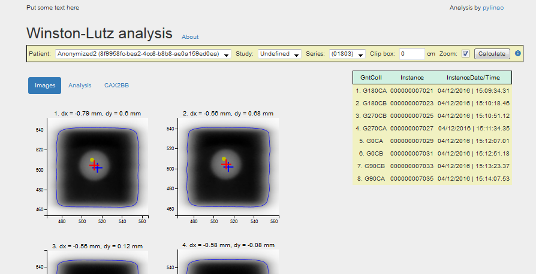

# Web interface for Pylinac's Winston Lutz module

This is a python web interface that connects pylinac with the Orthanc dicom server. Orthanc is a free dicom server that can receive and store dicom images so you don't have to work with files. The *wlweb* interface gives you the option of analysing MV images already stored in the Orthanc database. Since Orthanc accepts dicom transport from imaging workstations and R&V systems, doing an analysis on Winston-Lutz images becomes a matter of a couple of clicks.

The web interface is compatible with python 3.4 and pylinac 2.1.0. Because of an issue with mpld3, it will not work with more recent python versions. Instructions for setting up the interface are further down.

In oder to use the interface, you must set it up on a dedicated computer that is connected to your local hospital network (don't use clinical computers like TPS workstations, R&V stations etc.). This computer must be reachable from either the imaging workstation (at the linac) or from the R&V system. Once the computer and the web interface, together with the Orthanc server, are set up, you must configure the imaging station or the R&V system to be able to send dicom files.



### Dependencies

* [python 3.4](https://www.anaconda.com/download/)
* [pylinac 2.1.0](https://pylinac.readthedocs.io/en/latest/)
* [Bottle](https://bottlepy.org/docs/dev/)
* [httplib2](https://github.com/httplib2/httplib2)
* [mpld3](http://mpld3.github.io/)
* [Orthanc](https://www.orthanc-server.com/download.php)

And also numpy, scipy etc.

### What is in the *wlweb* package

The archive *wlweb.tar* contains software that was included to speed up the setting-up process. Specifically:

* [d3.v3.min](http://d3js.org/d3.v3.min.js)
* [mpld3.v0.3.min](https://github.com/mpld3/mpld3)
* [bootstrap](https://getbootstrap.com/)
* [Orthanc RestToolbox](https://github.com/jodogne/OrthancMirror/blob/master/Resources/Samples/Python/RestToolbox.py) - with modifications


# Setting up

I will assume that you are starting from scratch. We will install the python distribution Anaconda, create a python 3.4 environment, and install needed packages. We will also set up the Orthanc server.

The instructions are written for Windows 7 users. With little adaptation they should be useful for Linux users as well.

## Copying *wlweb* interface files

Download the *wlweb.tar* archive and extract it to a dedicated folder, for example C:\wlweb. The main module that we are trying to run is **run.py**. If you are using python version >3.4, you may be successful in running the run.py file, but the *wlweb* interface will not work because there is an issue with mpld3.

## Installing Anaconda and python 3.4

(If you already have a working python environment with python 3.4, you don't have to create a new environment if you don't want to.)

Download the latest Anaconda distribution from https://www.anaconda.com/download/ and install it. I suggest that you install it "just for you" in a dedicated folder like C:\Anaconda. After the install you may need to restart the system.

Once Anaconda is installed, you can activate the python environment by running Anaconda Prompt that you will find in the Anaconda directory (usually in Start Menu). The Anaconda Prompt will display the name of the default environment as `(base)`.

Now we must create and activate a separate environment (the one not called *base*) with python 3.4. Open the Anaconda Prompt and type in:

`conda create -n python34 python=3.4`

This will install python 3.4 and create a new environment called `python34`. After the installation has finished, activate the new environment:

`conda activate python34`

In the Anaconda Prompt go to the *wlweb* folder and run the following command:

`python run.py`

If you are new to command prompt, see this: http://www.ntu.edu.sg/home/ehchua/programming/howto/CMD_Survival.html. If you installed Anaconda without the option *Add Anaconda to my PATH environment variable*, then running python in Windows Command Prompt will not work.

The module *run.py* will not run because we are missing packages. First install the scipy package from conda (don't use pip):

`conda install scipy==0.19.1`

Then install the scikit packages:

`conda install scikit-image`

`conda install scikit-learn`

Then the rest with pip (except cherrypy):

`pip install pylinac==2.1.0`

`pip install bottle`

`pip install httplib2`

`pip install mpld3`

`pip install jinja2`

`conda install cherrypy`

Now try to run the module **run.py** again. It should work. If the **cherrypy** server does not work, you can replace it with a different one, like **paste**. You can install it with `pip install paste`. See the [Bottle documentation](https://bottlepy.org/docs/dev/deployment.html) for more information.

The cherrypy server may return an error `ImportError: cannot import name wsgiserver`. In this case, if you do not wish to use a different server, you must downgrade to an older version of cherrypy, say 3.8.0. See this: https://github.com/werwolfby/monitorrent/issues/185.


## Installing Orthanc
Download Orthanc from https://www.orthanc-server.com/download.php. I have been using version 1.2.0, so I suggest you use the same. You can chose either the installer or the command line application. Once downloaded, save/install it to a dedicated folder, for example **C:\Orthanc**. You could install Orthanc on a different computer than the *wlweb* interface. In this guide we will install both servers on the same computer.

### Configuring Orthanc
The folder should contain a special JSON configuration file. If the file is not present in the folder, you can generate it by running this in Windows Command Prompt (after opening CMD go to the Orthanc folder):

`Orthanc --config=Configuration.json`

Open the file in a text editor like Notepad++. First, set the *HTTP port for REST services and GUI*. This port must match with ORTHANC_PORT in the run.py module. I suggest that you set the port to 8042:

`"HttpPort" : 8042`

Next, set the dicom port to either 4242 or 104. Port 104 is usually used for dicom transport, but 4242 will also work.

`"DicomPort" : 4242`

Change the *UnknownSopClassAccepted* to true:

`"UnknownSopClassAccepted" : true`

Set *RemoteAccessAllowed* to true:

`"RemoteAccessAllowed" : true,`

Set *AuthenticationEnabled* to true:

`"AuthenticationEnabled" : true`

Define credentials for accessing the server:

`"RegisteredUsers" : {  
    "orthancuser" : "orthancpass"  
  },`

Delete "//" in front of the line to uncomment it. Match the username and password of the orthanc user with the values for USERNAME_ORTHANC and PASSWORD_ORTHANC in the run.py module, otherwise the interface will not be able to communicate with Orthanc. Just make up appropriate credentials.

Save the configuration file and run the Orthanc server:

`Orthanc configuration.json`

If everything is OK, you should be able to access the GUI of the server at

http://127.0.0.1:8042.

A hint: If you want to stop the server, press CTRL + C.

## Configuring run.py

If both servers are working, you should be able to open the *wlweb* web page. Go to:

http://127.0.0.1:8080/wlweb/winstonlutz

The *wlweb* server is running locally, it cannot be reached from another computer. The Orthanc server is, however, reachable from the network. Open Firefox on another computer and enter

http://IP_ADDRESS_OF_ORTHANC_COMPUTER:8042

It should work. Now we would like to set up the *wlweb* server to be reachable everywhere. Open the **run.py** module in a text editor. At the beginning of the module the following global variables can be edited:

```
INSTITUTION = "Put some text here"  
IP_ADDRESS = "127.0.0.1"  
PORT = 8080  
ORTHANC_IP = "127.0.0.1"  
ORTHANC_PORT = 8042  
USERNAME = "username"  
PASSWORD = "password"  
USERNAME_ORTHANC = "orthancuser"  
PASSWORD_ORTHANC = "orthancpass"  
PASS_RATE = 1.5  
SUCCESS_RATE = 1.0  
```

Let's go through the variables. The first one, INSTITUTION, is just a string of text that you would like to display in the header of the web page. Normally, this would be single line explanation of the interface or the name of your department/clinic. Just make up something. Or leave it empty, ie. "".

IP_ADDRESS is the IP address of the computer where you have installed the *wlweb* server. The default is *localhost*, but you must set it to the correct value by reading the IP address of your computer in the network adapter settings. If your computer's IP is 192.168.14.144, then you should set the IP_ADDRESS to "192.168.14.144".

PORT is the port where the *wlweb* server will listen to traffic. Set it to `80`. Default is 8080 (only for localhost).

ORTHANC_IP is the IP address of the computer where the Orthanc server is running. In this guide the Orthanc server runs on the same computer as *wlweb*, so the value of this variable should be equal to IP_ADDRESS. But, in principle, you could run the Orthanc server on a different computer.

ORTHANC_PORT is the port where the Orthanc is listening. The value is defined in the *configuration.JSON* of the Orthanc server. In this guide the suggested port is 8042.

USERNAME and PASSWORD are the credentials that you will be using when opening the *wlweb* web interface. Only one username/password is possible. Make something up.

USERNAME_ORTHANC and PASSWORD_ORTHANC are the credentials that the *wlweb* server must use in order to communicate with Orthanc. The values must match those set in the *configuration.json*. See previous section.

PASS_RATE and SUCCESS_RATE are the tolerances for the Winston Lutz test. If the distance between the center of the BB and the center of the field is less than PASS_RATE, the test will have passed. If the distance is between PASS_RATE and SUCCESS_RATE, the results will be on the borderline. If the distance is larger than SUCCESS_RATE, the result will show a failed status.


# Using the web interface

OK, so we have everything working. Now we must get some images into Orthanc.

If you do not have any dicom images handy, you can download some sample images from the *wlweb* respository.

Download the images and upload them to the Orthanc server manually by going to the GUI and dragging images into the upload widget. Then go to the *wlweb* interface.

## How to analyse images
When you open the *wlweb* interface, it automatically reads all the patients from the Orthanc database. If you have just uploaded images to Orthanc while *wlweb* interface was open, then you must refresh the *wlweb* page.

When you select a patient in the dropdown menu, *wlweb* will fetch all the studies that belong to this patient. When you select a specific study, *wlweb* will fetch all the series that belong to it. And finally, when you select a series, *wlweb* will print out all the images that are contained in the series in chronological order of acquisition. The image list is separately shown on the right side of the page.

When you click Calculate, *wlweb* will retrieve the selected instances from Orthanc, store them temporarily in a local folder, and then pass them to pylinac for analysis. Just before the result is returned back to *wlweb*, the temporary dicom images are deleted. Temporary files are stored in the folder `temp_dcm_archive`. Do not delete this folder, even if it is empty.

### Clip box

This function was added because I had problems with iViewGT images. If you have images with artifacts that are outside the field, then you can use this parameter to force portions of the image pixels to have background value. See https://gist.github.com/jrkerns/6e0a2a3182e2e2cadc22b236e4bc87aa.

An example. Say your field size is 5x5 and you have unwanted artifacts a couple of cm outside of the field. If you define a clip box of 10 cm, this will leave the central 10x10 portion of the image untouched, but the pixels outside this region will have a forced background value. The untouched area will be marked with a green contour. Hopefully, this will help pylinac to analyse the image.

If you leave clip box = 0, then images are analysed as they are.


### Zoom

If checked, then the image will be zoomed in to show the field. If unchecked, the image will not be zoomed in. This has no influence on the analysis.

# How to acquire images to determine linac isocenter

When you open *wlweb* page, please read the "about". It explains how to acquire images and what the results mean.

There are two sets of images that can be considered minimalistic when searching for the MV isocenter of the linac.

* 4 images with a stereotactic cone at gantry angles 180, 270, 0 and 90.
* 8 images with MLCs at gantry angles 180, 270, 0 and 90, at each gantry with two opposite collimator angles (similar to Elekta flexmap acquisition).

In these two cases the *wlweb* interface will give you additional information, not just single image analysis.

If you do the analysis with an arbitrary number of images, then the *wlweb* interface will return basic results that you will have to interpret.

## Sending images to Orthanc from the linac

You can send images to Orthanc via standard dicom transport. Elekta's iView is easily configured to export images to Orthanc with almost a single click of a button. It is only necessary to add an export server information into **sri.ini** and **mergecom.app** files. If you don't know how to do this, ask your service engineers to help you. Just give them the data of the Orthanc server (AETitle, IP address and port). ***In no case do it yourself, if you don't know what you are doing!*** If something goes wrong, iView may no longer work correctly.

In Aria it is easy to create a new DICOM Storage Export Filter in the DICOM IMPORT/EXPORT module. Read the manual. When creating the export filter, use settings similar to this:

```
NAME: ORTHANC
AETitle: ORTHANC
IP/Hostame: IP ADDRESS OF Orthanc
Port: 4242
```

For AETitle enter the same name as defined by "DicomAet" in *configuration.json*.
Now you can export collected images from Aria to Orthanc. Be careful when selecting the images to export. When you export via the import/export module, Ariaautomatically checks all the images that belong to the open patient. If you miss this, you could be sending many images to Orthanc.

# Warnings

I cannot guarantee that everything works correctly, therefore the risk of using this software is yours in the broadest sense possible. Do not rely on the results of this software without checking that it works and calculates correctly. See the [LICENSE](LICENSE.md) to understand the scope of your responsibility for using this software.

Use only Firefox or Chrome to run the *wlweb* interface.

The web interface was originally meant to be a simple analyzer of WL images. I was only interested in determining the center of the BB and the center of the field image-wise, without regard to gantry, collimator and couch angles. Pylinac offers much more data based on the knowledge of gantry, collimator and couch angles. So if you want pylinac's full and original analysis in a way that was meant to be used, then you will have to follow:

 [https://pylinac.readthedocs.io/en/stable/winston_lutz.html](https://pylinac.readthedocs.io/en/stable/winston_lutz.html)

# License

This project is licensed under the MIT license. See [LICENSE](LICENSE.md).

Denis Brojan, Ljubljana, 2019
